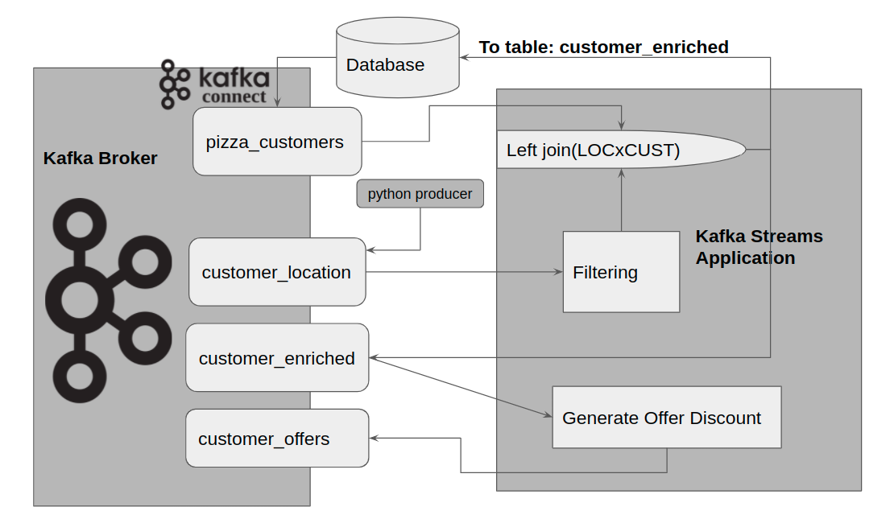
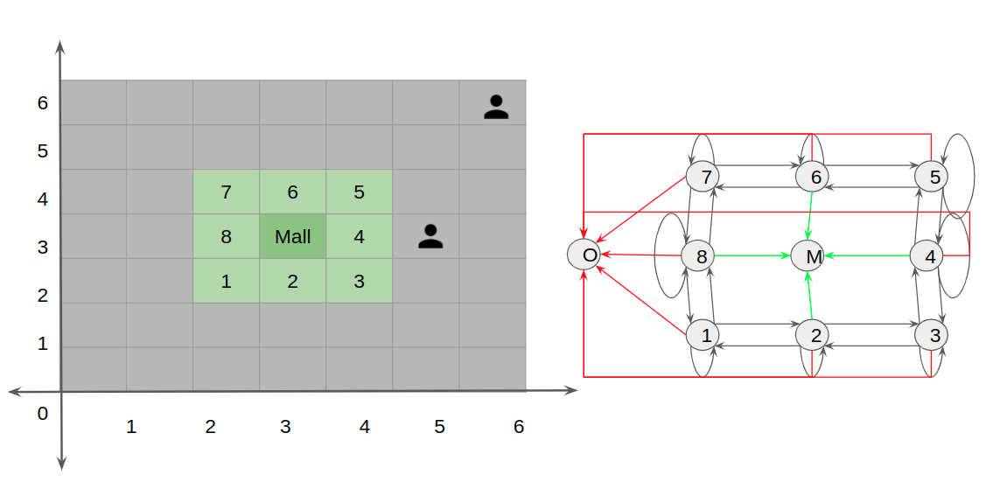

# CustomerLocationStreamApp
## Application Architecture

## Simulation Details
### Divide area into regions

### Number regions

### State Transitions
Nodes are divided into 2 groups -edge and direct  
Direct nodes - nodes with entry to mall  
Edge nodes - other nodes 
For Edge Nodes: 
<table>
<tr>
  <th>Direction</th><th>Probablity</th><th>CumulativeProbablity</th>
</tr>
<tr>
  <td>Backward</td><td>0.15</td><td>0.15</td>
</tr>
<tr>
  <td>Same</td><td>0.2</td><td>0.35</td>
</tr>
<tr>
  <td>Outside</td><td>0.3</td><td>0.65</td>
</tr>
<tr>
  <td>Forward</td><td>0.35</td><td>1.0</td>
</tr>
</table>

For Direct Nodes
<table>
<tr>
  <th>Direction</th><th>Probablity</th><th>CumulativeProbablity</th>
</tr>
<tr>
  <td>Outside</td><td>0.05</td><td>0.05</td>
</tr>
<tr>
  <td>Backward</td><td>0.15</td><td>0.20</td>
</tr>
<tr>
  <td>Same</td><td>0.2</td><td>0.40</td>
</tr>
<tr>
  <td>Forward</td><td>0.25</td><td>0.65</td>
</tr>
  <tr>
  <td>Mall</td><td>0.35</td><td>1.0</td>
</tr>
</table>

For OutsideNode
<table>
<tr>
  <th>Direction</th><th>Probablity</th><th>CumulativeProbablity</th>
</tr>
<tr>
  <td>Same</td><td>0.6</td><td>0.60</td>
</tr>
<tr>
  <td>Random Node b/w 1-8</td><td>0.4</td><td>1.0</td>
</tr>
</table>

For Mall Node
<table>
<tr>
  <th>Direction</th><th>Probablity</th><th>CumulativeProbablity</th>
</tr>
<tr>
  <td>Same</td><td>0.6</td><td>0.60</td>
</tr>
<tr>
  <td>Random Node - [2,4,6,8]</td><td>0.4</td><td>1.0</td>
</tr>
</table>

Strategy: 
Generate a random number using random.random() 
Use the CF table to assign a node 
For ex if the random number generated was 0.3456, then for the edge node this value falls in the 'Same' bucket
